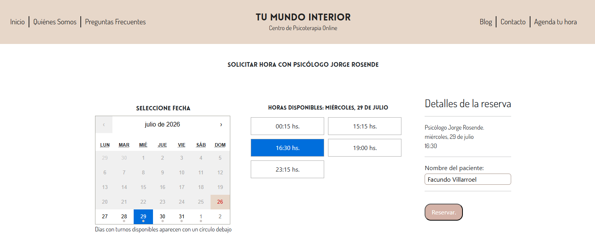

# Tu Mundo Interior REST API

Backend API for the Tu Mundo Interior appointment management platform.

Tu Mundo Interior REST API was developed as part of a complete solution for a practicing psychologist who needed more than a professional website.

The goal was to simplify appointment scheduling, validate availability against an existing Google Calendar and allow website content to be managed independently without requiring developer intervention.

This API centralizes the application's business logic and serves the frontend through secure REST endpoints.

Built with **Node.js**, **Express**, **Firebase Authentication**, **JWT**, **Google Calendar API** and **Mailjet**.

<p align="center">
    
</p>

## Features

- 📅 Manage appointment requests and availability.
- 🔄 Validate appointment availability through Google Calendar integration.
- 🔐 Secure administrator authentication using Firebase Authentication and JWT.
- ✍️ Manage blog articles through dedicated administration endpoints.
- 📧 Send automated email notifications.
- ⚡ Provide REST endpoints consumed by the frontend application.
- 🛡️ Protect private resources through authentication and authorization middleware.


## How the System Works

The platform follows a simple workflow:

1. A patient requests an appointment from the frontend application.
2. The backend validates availability against the psychologist's Google Calendar.
3. If the selected time is available, the booking is confirmed.
4. Confirmation emails are automatically sent.
5. Administrators can independently manage website content and blog articles through authenticated endpoints.

This approach keeps scheduling synchronized with the psychologist's existing workflow while minimizing manual administrative tasks.

## External Services

The backend integrates with external services to automate several business processes.

| Service | Purpose |
|---------|----------|
| **Firebase Authentication** | Administrator authentication |
| **Google Calendar API** | Validate appointment availability |
| **Mailjet** | Send appointment confirmation emails |

## Calendar Integration

One of the most interesting challenges of this project was integrating appointment booking with the client's existing workflow.

Instead of automatically creating events in Google Calendar, the platform only reads calendar availability.

This decision was made to respect the client's preferred way of managing appointments while still preventing double bookings.

Before confirming a reservation, the backend checks the public calendar and only allows appointments during available time slots.


## Related Project

This backend powers the frontend application available at:

💻 **[Tu Mundo Interior Web](https://github.com/FacundoVillarroel/tumundointeriorweb)**

## What I Learned

Developing this project taught me that successful software is not only about writing clean code, but also about understanding how people actually work.

Working directly with a real client forced me to balance technical decisions with usability, adapting the solution to an existing workflow instead of replacing it.

This experience reinforced the importance of requirements gathering, communication and designing software around real business needs rather than simply implementing technical solutions..

## Getting Started

### Requirements

Before running the project, make sure you have:

- Node.js 20+
- npm
- Firebase project configuration
- Google Calendar API credentials
- Mailjet account

---

### Installation

```bash
git clone https://github.com/FacundoVillarroel/tumundointeriorserver.git

cd tumundointeriorserver

npm install
```

---

### Environment Variables

Create a `.env` file in the project root.

Example:

```env
PORT=8080

JWT_SECRET=your_jwt_secret

FIREBASE_PROJECT_ID=your_project_id
FIREBASE_CLIENT_EMAIL=your_client_email
FIREBASE_PRIVATE_KEY=your_private_key

GOOGLE_CLIENT_ID=your_google_client_id
GOOGLE_CLIENT_SECRET=your_google_client_secret

MAILJET_API_KEY=your_mailjet_api_key
MAILJET_SECRET_KEY=your_mailjet_secret_key
```

> **Note:** Additional environment variables may be required depending on your Firebase, Google Calendar and Mailjet configuration.

---

### Running the API

> **Note:** The backend requires the frontend application to fully test the appointment booking workflow.

```bash
npm run dev
```

The server will be available at:

```text
http://localhost:8080/
```

## Author

**Facundo Villarroel**

Full Stack Software Developer with a strong interest in backend development, software architecture and building solutions for real-world problems.
- GitHub: https://github.com/FacundoVillarroel
- LinkedIn: https://www.linkedin.com/in/villarroelfacundo/

---

## License

This project is licensed under the MIT License.
